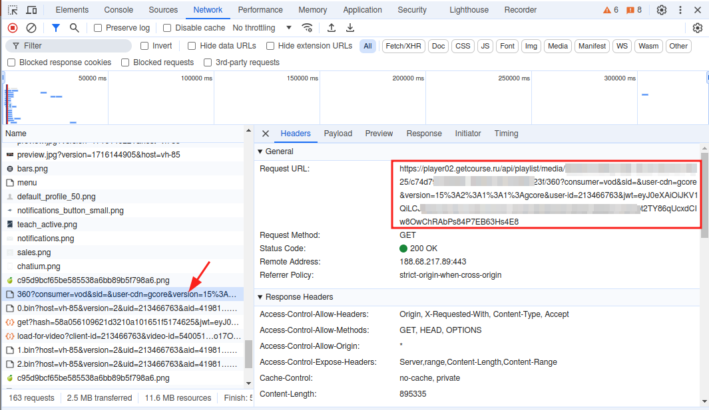
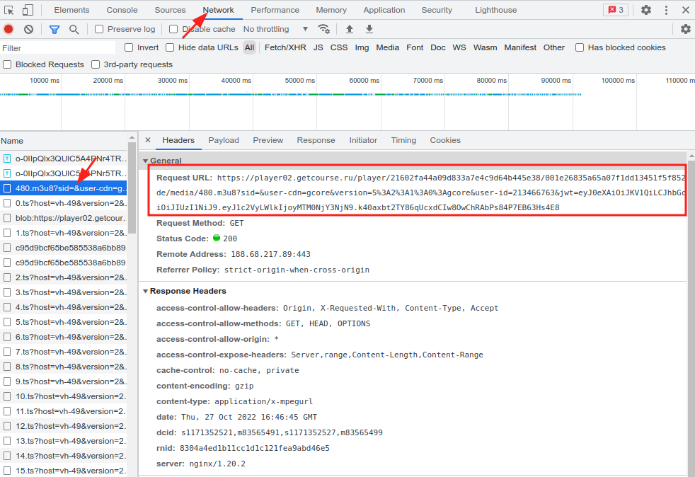
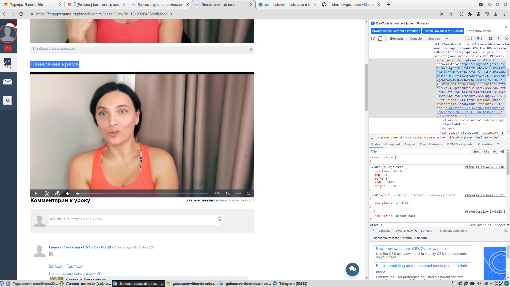
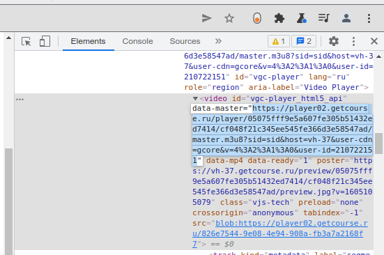

# Скрипт для скачивания видео с GetCourse без перекодирования

## Введение

Некоторые [инструкции в интернете](https://www.nibbl.ru/poleznye-sovety/kak-skachat-video-s-getkursa-getcourse.html) предлагают скачивать видео с GetCourse с помощью VLC, однако это требует перекодирования видео.

Этот скрипт скачивает видео-уроки с Геткурса без перекодирования. Работает на Linux, BSD, macOS и в др. UNIX-подобных окружениях.

Для работы необходимы `bash` и `curl`.

## Как достать ссылку на видео

GetCourse иногда меняет алгоритмы, ниже описано 2 способа, как достать ссылку на видео. Если вы считаете, что GetCourse снова изменил алгоритмы, сообщите об этом в [issues](https://github.com/mikhailnov/getcourse-video-downloader/issues).

### Способ 1

* Откройте страницу с видео в браузере Chromium / Google Chrome
* Нажмите правой правой кнопкой мыши на видео, выберите "Просмотреть код"
* В открывшейся панели разработчиков откройте вкладку "Network"
* Перезагрузите страницу в браузере
* Выберите нужное разрешение видео в настройках видеоплеера GetCourse
* Запустите проигрывание видео, дайте проиграться около секунды и поставьте на паузу
* Найдите и скопируйте ссылку ("Request URL") на скачанный файл с именем в виде числа, совпадающего с разрешением видео в плеере (360, 720, 1080 и т.д.)




Если такого файла нет, то поищите файл `*.m3u8`:



### Способ 2

* Откройте страницу с видео в браузере Chromium / Google Chrome
* Нажмите правой правой кнопкой мыши на видео, выберите "Просмотреть код"
* В открывшемся коде найдите: `<video id="vgc-player_html5_api" data-master="ДЛИННАЯ_ССЫЛКА"`
* Скопируйте эту ссылку (ДЛИННАЯ_ССЫЛКА)




## Запуск скрипта

Откройте терминал и выполните команду скачивания этого скрипта:

`curl -L --output /tmp/getcourse-video-downloader.sh https://github.com/mikhailnov/getcourse-video-downloader/raw/master/getcourse-video-downloader.sh`

Затем запустите скрипт:

`bash /tmp/getcourse-video-downloader.sh "ДЛИННАЯ_ССЫЛКА" "Имя файла.ts"`

Первым аргументом идет ссылка, вторым — имя файла, куда сохранить скачанное, рекомендуемое расширение — ts.

На ROSA Linux можно установить этот скрипт из репозитория:

```
sudo dnf install getcourse-video-downloader`
getcourse-video-downloader "ДЛИННАЯ_ССЫЛКА" "Имя файла.ts"
```
